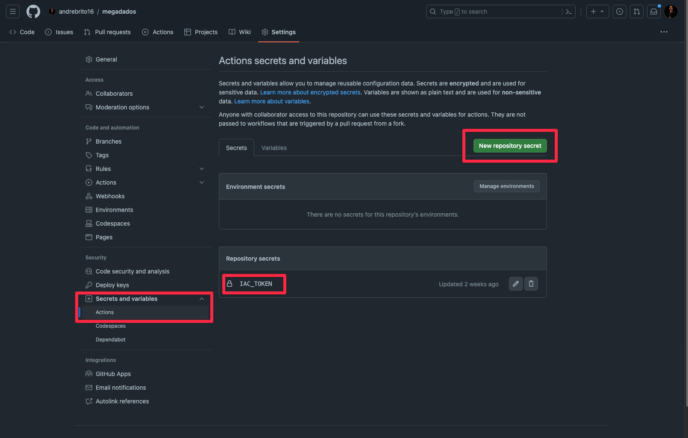
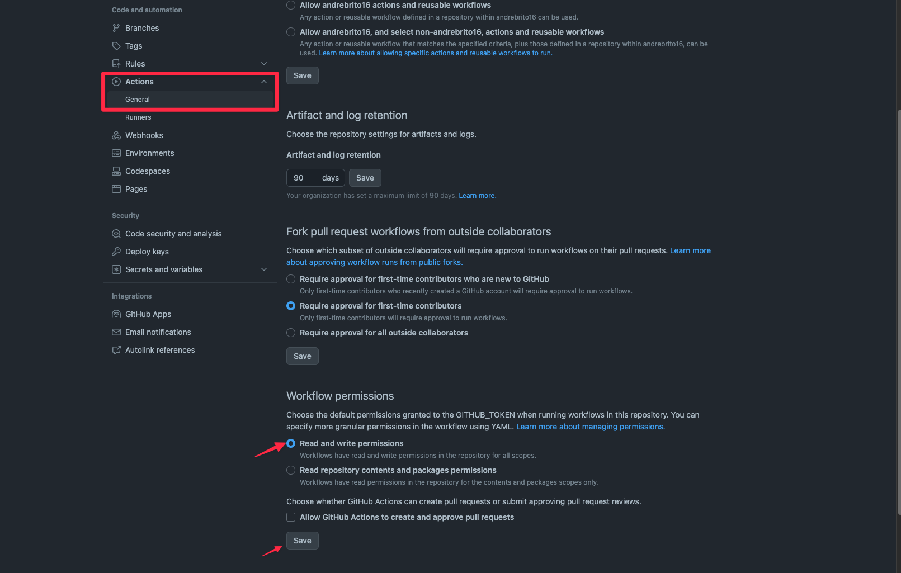

# Insper Autograding SVG Generator - Megadados

# Sumário
- [Preview](#preview)
- [Como usar](#como-usar)

# Preview


# Como usar:

1. Crie um repositório no Github, com um arquivo `README.md` na raiz.
2. Vá nas configurações do repositório, e na aba `Secrets and variables` escolha `actions`. E adicione a variável `IAC_TOKEN` com o token do Insper Autograding que recebeu em seu e-mail.



3. Na aba `actions` `general`, habilite as permissões de escrita, para que a action possa publicar seu svg na branch `output` do seu repositório.



4. Agora copie o conteúdo do arquivo [workflow.yml](workflow.yml) para o arquivo `.github/workflows/main.yml` do seu repositório.

5. Por fim, adicione o badge no seu `README.md`:

```

```

**Não esqueça de trocar `<SEU USUARIO>` e `<SEU REPOSITORIO>` pelo seu usuário e repositório.**

O badge será atualizado a cada 10 minutos ou a cada push para a branch `main` ou `master` do repositório.

Com ❤️ por [André Brito](https://andreb.dev).